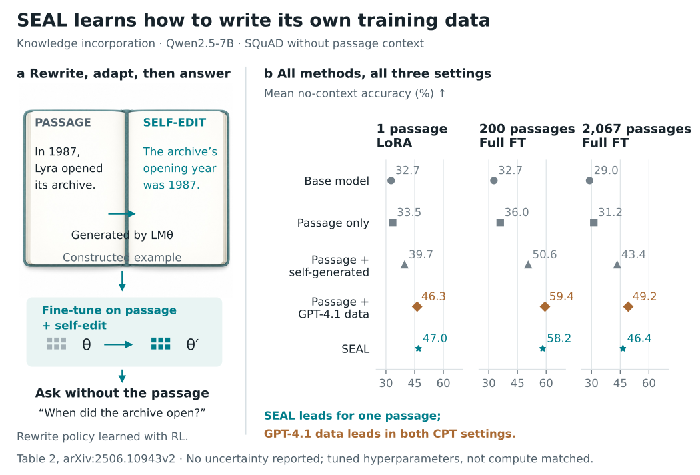

# Paper Visual Design

A research-figure toolkit that starts with the science and a figure plan, then creates **teasers, method diagrams, conditional benchmark/setup figures, and standalone experimental graphs**. Optional image-generated illustrations combine with editable SVG labels, wiring, and reproducible plots.

**Start with [`paper-visual-design`](skills/paper-visual-design/SKILL.md).** It is the new, self-contained planning and routing skill. The existing [`paper-figure-creation`](skills/paper-figure-creation/SKILL.md) remains available and supplies its bundled evidence checks and rendering foundation. Your existing customizations should be retained when installing an update.



## Which workflow should the agent use?

| Request | Route | Result |
| --- | --- | --- |
| “Plan the figures for this paper” | [Planning](skills/paper-visual-design/references/planning.md) | Applicable figure inventory, source contracts, composition choices, and build order |
| “Explain the problem and why our method matters” | [Teaser](skills/paper-visual-design/references/teaser.md) | About 35% concept/example and 65% source-grounded comparison, unless a documented exception fits better |
| “Show how the algorithm or architecture works” | [Method](skills/paper-visual-design/references/method.md) | Exact operations, component internals, branches, training/inference, and a consistent example |
| “Explain the benchmark/environment” | [Setup](skills/paper-visual-design/references/benchmark.md) | Task instance, information access, interactions/construction, and scoring—only if a substantive setup exists in the paper |
| “Plot the results, ablations, or tradeoffs” | [Graphs](skills/paper-visual-design/references/graphs.md) | Standalone reproducible vector graphs with source-traced values and truthful uncertainty |
| “Show where and why our method works on recorded cases” | [Qualitative comparisons](skills/paper-visual-design/references/qualitative.md) | Matched observations, measured criteria, and diagnostics with explicit limits on causal claims |
| “Combine illustrations, diagrams, and graph panels” | [Hybrid assembly](skills/paper-visual-design/references/hybrid.md) | One SVG composition with optional raster illustrations and exact editable scientific layers |
| “Improve this figure” | Relevant route + [review](skills/paper-visual-design/references/review-delivery.md) | Specific communication defects repaired and revised pixels inspected |

The existing qualitative-comparison, asset-sourcing, connector-routing, publication-polish, layout/overflow, and manuscript-review workflows are preserved in the foundation. The new front door routes to them when relevant.

These are choices, not a mandatory four-figure package. Benchmark mentions and result tables alone do not trigger a setup diagram. A benchmark paper need not invent an algorithm architecture. Image generation is useful when an illustrative asset helps; numerical plots and authoritative wiring always remain deterministic.

## Install and invoke

Copy the **entire** `skills/paper-visual-design` folder to your agent's personal or project skill directory. It includes `foundation/`, so another skill installation or repository checkout is not required at runtime. The repository's research and example folders are optional.

```bash
git clone https://github.com/Mishrakshitij/paper-figure-creation-skill.git
cd paper-figure-creation-skill
# Codex CLI personal skill; use a project .agents/skills directory if preferred.
mkdir -p ~/.agents/skills
cp -R skills/paper-visual-design ~/.agents/skills/
# Claude Code: copy the same folder into ~/.claude/skills/ instead.
```

To update a repository clone, use `git pull --ff-only`, inspect changes, then copy the full skill folder into the location your agent actually discovers. If that folder already exists, compare and preserve your customizations before replacing it. In ChatGPT, use the installed **Paper Visual Design** skill. Explicit invocation:

> Use **$paper-visual-design** to plan the applicable figures and experimental graphs for this manuscript. Read the method and results first. Explore three compositions for complex figures, use generated illustrative assets only where useful, and keep labels, connections, and data plots editable. Export PDF, SVG, PNG, source, and a brief review record.

Claude Code can invoke `/paper-visual-design`. Attach the manuscript, relevant code/equations, result tables or raw measurements, and venue template when available. No specific model name or API key is required by the skill; optional image-generation capability depends on the host agent.

The companion `codex-paper-figure-skill` informed native editable-diagram planning. Its code/artwork is not copied and it is not a required dependency. See [companion integration](skills/paper-visual-design/references/companions.md).

## Build a figure

The working sequence is **understand → plan → choose representation → build graphs/assets → compose → inspect → repair → deliver**. Save a compact [figure plan](skills/paper-visual-design/assets/figure-plan.md) first. Do not stop for approval on routine reversible work already requested.

From this repository:

```bash
python -m pip install -r requirements.txt
python skills/paper-figure-creation/scripts/validate_evidence.py figure.json
python skills/paper-figure-creation/scripts/render_graphs.py graphs.json --output output/graphs
python skills/paper-figure-creation/scripts/render_figure.py method.json --output output/method --strict-layout
python skills/paper-figure-creation/scripts/compose_svg.py composition.json --output output/figure --formats svg,pdf,png
```

In a standalone installation, the same scripts are under `paper-visual-design/foundation/scripts/`. The graph renderer supports dot, bar, line, and scatter plots; use custom Matplotlib for other justified encodings under the same evidence/review requirements. Hybrid SVG assembly uses physical points and preserves imported vector plots; PDF/PNG export needs **Inkscape**. See the [graph schema](skills/paper-figure-creation/references/graphs-spec.md) and [composition schema](skills/paper-figure-creation/references/composition-spec.md).

For model-size versus Elo, component ablations, learning curves, heatmaps, and distributions, use the [research graph recipes](skills/paper-visual-design/references/graph-recipes.md). They require project measurements and document rating-pool comparability, uncertainty, missing data, and scientific units. No user-specific Elo values are bundled.

The starter renderer is useful for compatible layouts. Bespoke SVG, Matplotlib, TikZ, or native draw.io is encouraged when the scientific explanation requires different geometry. Keep one canonical geometry source. Never force the science into a convenient template.

## Examples by job

| Job | Example and reproducible source | What to inspect |
| --- | --- | --- |
| Standalone graphs | [LoRA tradeoffs](examples/graphs-lora/) | All eight method/settings, two tasks, log parameter axis, and exact evidence references |
| Hybrid teaser + graphs | [SEAL composition](examples/seal-composed/) | Generated illustrative asset + exact SVG explanation + all three knowledge conditions, including unfavorable comparisons |
| Method | [Independent LoRA method](examples/lora-forward/) · [SEAL method](examples/seal/) · [MAE hybrid method](examples/mae-hybrid/) | Candidate branches and training return; persistent patch identities and masked-only loss |
| Interactive setup | [WebArena](examples/webarena-v3/) | One concrete state change and a separate evaluator |
| Procedural benchmark | [ReasoningGym](examples/reasoning-gym-forward/) | Generated task, model-visible question, and private scoring information |

The [full gallery](examples/README.md) keeps earlier iterations for comparison. Examples are original explanatory redraws, not author-endorsed figures or newly reproduced experiments. Generated imagery and constructed examples are identified separately from reported evidence.

## Repository map

| Path | Purpose |
| --- | --- |
| `skills/paper-visual-design/` | Self-contained front door: concise router, workflow references, plan template, bundled foundation |
| `skills/paper-figure-creation/` | Preserved foundation and canonical source of shared renderers, validators, design references, and templates |
| `scripts/sync_visual_design_bundle.py` | Deterministically update/check the copied foundation; do not hand-edit both copies |
| `examples/` | Source data, build scripts, editable outputs, captions, provenance, and visual reviews |
| `tests/` | Evidence, setup eligibility, graph, renderer, and composition regression checks |
| `research/` | Source/version ledgers and bounded visual-reference reviews |
| `docs/` | Design plans, evaluation records, and change history |

After changing the foundation, rebuild and check the bundle:

```bash
python scripts/sync_visual_design_bundle.py
python scripts/sync_visual_design_bundle.py --check
python -m unittest discover -s tests -v
```

## Quality, evidence, and limits

The skill preserves nine standing requirements: understand the science; explain visually; explore composition; combine optional generation with vector precision; style consistently; trace scientific claims; inspect and iterate; deliver reproducible editable artifacts; integrate and verify the manuscript when requested.

Checks cover declared values, both graph axes, comparison context, uncertainty and improvement arithmetic, conditional setup contracts, physical composition, and asset provenance. They cannot establish source truth, fair baseline selection, comprehension, or all visual collisions. Inspect actual PDF/PNG pixels at manuscript size and enlarged, and use independent scientific review when available. A valid export is not a publication-quality certificate.

The [current plan](docs/toolkit-plan.md), [validation and review record](docs/toolkit-validation.md), and [reference review](research/toolkit-references/review.md) document this revision. This review inspected five reference repositories, 20 source/license files and four rendered assets. Earlier [research](research/README.md) includes a 500-paper metadata corpus, but does **not** claim 500 close visual reviews. No controlled superiority claim is made for this skill.

## License and provenance

Original code, documentation, and vector redraws are MIT licensed. Paper facts, citations, generated illustrations, and external assets retain their declared provenance; the repository license does not grant rights to third-party figures. See the [source/license ledger](research/toolkit-references/source-ledger.json). In particular, ChenLiu-1996/figures4papers currently uses CC BY-NC 4.0: it was inspected as a reference, and its code/artwork was not copied into this toolkit.
