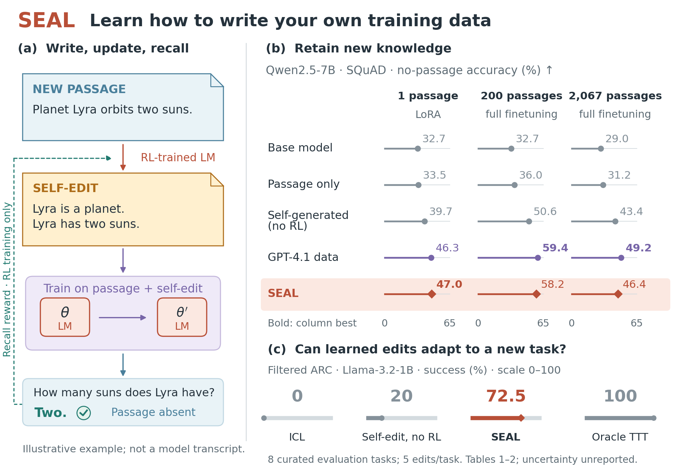
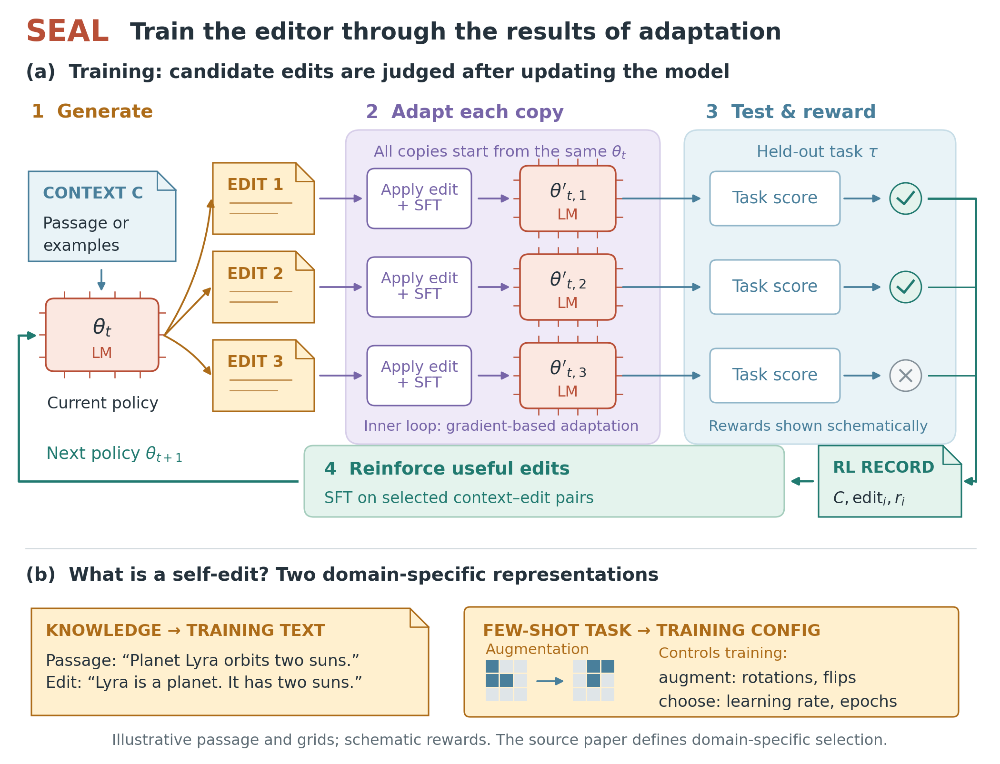
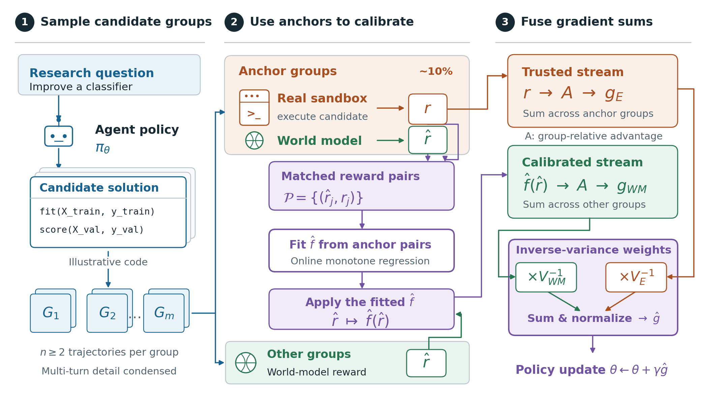
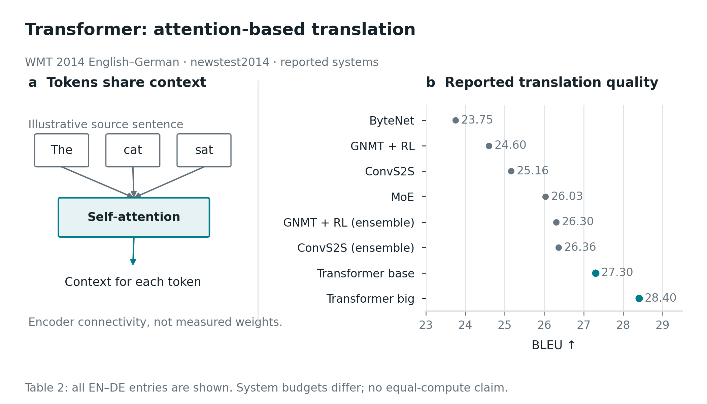
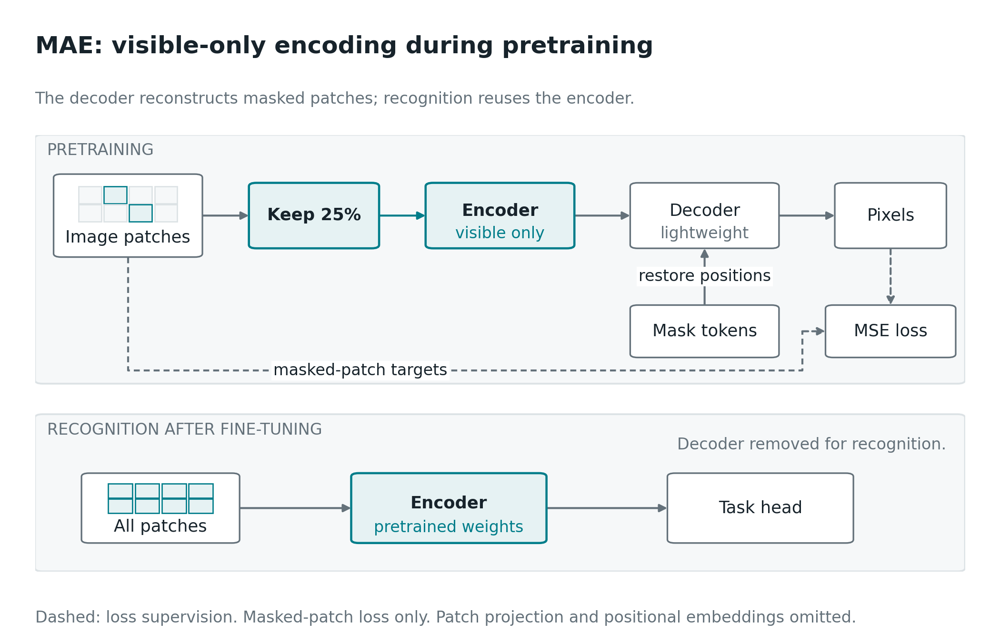
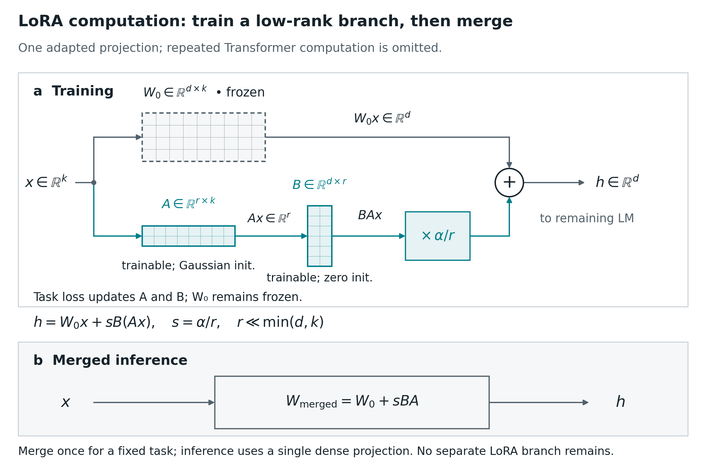

# Example gallery

These are original explanatory redraws using published data. They are not the original authors' artwork or new experimental reproductions. Each directory preserves source/specification, editable vector output, PDF and PNG.

## Revised visual examples

These examples address the first gallery's generic representations. The [design review](../docs/design-upgrade.md) records what changed and what remained uncertain. Teaching scenes, passages and schematic rewards are identified in the figures; reported plots retain their source ledgers.

| Paper | Figure and editable exports | What the drawing now makes visible |
| --- | --- | --- |
| MAE | [PNG](mae-v2/figure.png) · [PDF](mae-v2/figure.pdf) · [SVG](mae-v2/figure.svg) · [source](mae-v2/build_figure.py) | One scene, retained patch identities, packed visible inputs, asymmetric computation, restored positions and masked targets |
| SEAL teaser | [PNG](seal/seal-teaser.png) · [PDF](seal/seal-teaser.pdf) · [SVG](seal/seal-teaser.svg) · [source](seal/build_figures.py) | A concrete self-edit connected to recall, all reported methods across three knowledge settings, and the filtered-ARC comparison |
| SEAL method | [PNG](seal/seal-method.png) · [PDF](seal/seal-method.pdf) · [SVG](seal/seal-method.svg) | Parallel candidate edits, independent adapted model states, post-adaptation scoring and the policy update |
| WMRL method | [PNG](wmrl/wmrl-method.png) · [PDF](wmrl/wmrl-method.pdf) · [SVG](wmrl/wmrl-method.svg) · [source](wmrl/build_figure.py) | Candidate groups, the paired anchor route, fitting versus applying calibration, and reliability-weighted update fusion |

The [earlier MAE method](mae-method/figure.png) is preserved for a same-paper visual comparison. This is an authored redesign, not a matched independent experiment measuring the skill's effect. Rebuild commands and captions live beside each revised example.

## Earlier gallery

These examples document the initial implementation. They preserve useful evidence and export behavior, but they are not the new ceiling for visual explanation.

| Paper | Teaser | Method | What the case tests |
| --- | --- | --- | --- |
| MAE | [PNG](mae-teaser/figure.png) · [PDF](mae-teaser/figure.pdf) · [SVG](mae-teaser/figure.svg) | [PNG](mae-method/figure.png) · [PDF](mae-method/figure.pdf) · [draw.io](mae-method/figure.drawio) | Real masking representation, cost-quality trade-off, training/inference separation |
| Transformer | [PNG](transformer-teaser/figure.png) · [PDF](transformer-teaser/figure.pdf) · [SVG](transformer-teaser/figure.svg) | [PNG](transformer-method/figure.png) · [PDF](transformer-method/figure.pdf) · [draw.io](transformer-method/figure.drawio) | Complete task-specific baseline list, ensemble labels, attention conditioning, correct repeated-block scope |
| LoRA | [PNG](lora/lora-teaser.png) · [PDF](lora/lora-teaser.pdf) · [SVG](lora/lora-teaser.svg) | [PNG](lora/lora-method.png) · [PDF](lora/lora-method.pdf) · [SVG](lora/lora-method.svg) | Independent use of the skill, two task comparisons, parameter budget, frozen/trainable branches |

Rebuild the MAE/Transformer JSON specs with `python examples/build_specs.py`. Render each with the skill's `scripts/render_figure.py SPEC --output PATH --strict-layout`. LoRA uses its own source in `lora/` to exercise the skill's custom-layout route. Read the captions alongside the figures.

The [review history](review-history/) preserves initial outputs with known defects for audit, and [evaluation](../docs/evaluation.md) explains the repairs. Initial images are not approved examples. Synthetic starter templates are labeled separately from these reported-data redraws.
