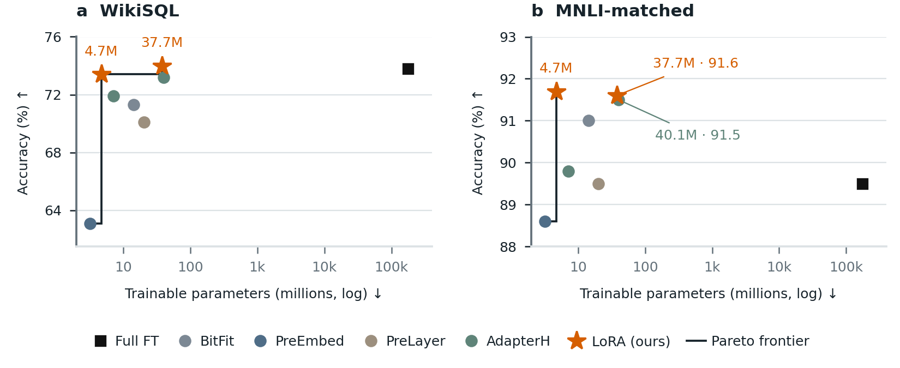

# House-style Pareto teaser: LoRA accuracy versus trainable parameters



This example redraws the eight GPT-3 settings of
[LoRA, arXiv:2106.09685v2, Table 4](https://arxiv.org/pdf/2106.09685v2) in the
house figure standard ([house-figure-standard.md](../../skills/paper-figure-creation/references/house-figure-standard.md)).
It uses the same evidence ledger as [graphs-lora](../graphs-lora/); only the
encoding changes. Run from the repository root:

```sh
python examples/graphs-house-pareto/build.py
```

What the example exercises:

- `figure.preset: "house"`: built at 5.5 × 2.25 in, the ICLR/NeurIPS `\linewidth`,
  so `\includegraphics[width=\linewidth]{house-pareto.pdf}` prints every label at
  6 pt and panel titles at 7.5 pt. The review JSON reports a 6.0 pt minimum.
- Role encodings from [paper-styles.json](paper-styles.json), the paper's style
  registry: the proposed method is a large vermillion star with "(ours)" in the
  legend, baselines are muted circles, and the full fine-tuning reference is a
  black square. Every figure of a paper renders with the same registry, so a
  method keeps its colour and marker everywhere.
- Better-direction arrows come from the ledger (`accuracy: higher`,
  `trainable parameters: lower`). The labels in the spec carry no arrows; a typed
  arrow that contradicted the ledger would stop the build.
- `pareto` computes the non-dominated plotted points and draws them as a step
  line: PreEmbed 3.2M, LoRA 4.7M and LoRA 37.7M on WikiSQL, and PreEmbed 3.2M and
  LoRA 4.7M on MNLI. `house-pareto-review.json` lists them per panel.
- One series per method: AdapterH and LoRA each contribute two settings, so the
  legend has one entry per method.

Review: the PNG was inspected enlarged, and the PDF was rasterized at 150 dpi in
colour and grayscale. The MNLI LoRA 37.7M (91.6) and AdapterH 40.1M (91.5) points
sit almost on top of each other because the measurements are close. Direct labels
with leader lines separate them; the coordinates are unchanged. In grayscale, the
star, square and circle shapes keep the roles apart, but the four baselines differ
only in shade, so name them in the caption or label them directly when a reader
must tell them apart. The figure carries no title or note line: the caption holds
the takeaway and the evidence grade.
