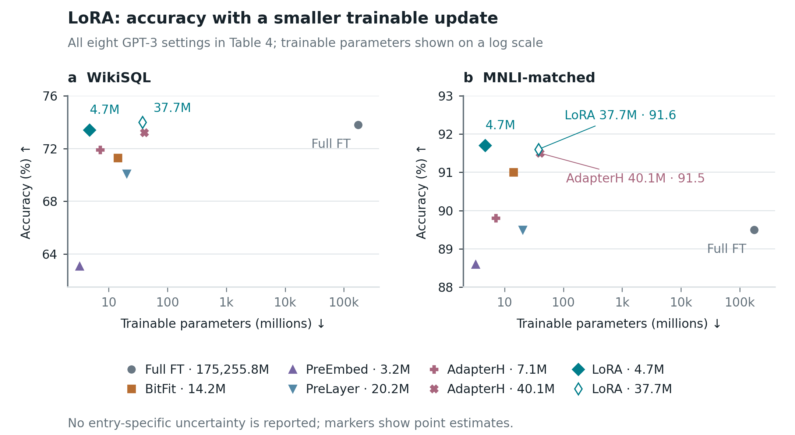

# LoRA: two-task parameter/accuracy tradeoff



This example uses every one of the eight GPT-3 method/parameter settings from
[LoRA, arXiv:2106.09685v2, Table 4](https://arxiv.org/pdf/2106.09685v2), for WikiSQL
and MNLI-matched. The values were already transcribed into the repository's
`examples/lora/table4.json` and source-linked `teaser.spec.json`; this example
changes the visual question to accuracy versus trainable parameters.

Run from the repository root:

```sh
python examples/graphs-lora/build.py
```

The canonical geometry is `graphs.spec.json` interpreted by `render_graphs.py`.
Exports are fixed at 7.2 × 3.95 inches with 8 pt body labels, 300 dpi PNG, editable
SVG text, and PDF. No external illustration or copied plotting code is used.

Three candidate compositions were considered: a methods-by-metric dot matrix
(best for exact rankings, weak on resource cost), this pair of log-scale tradeoff
plots (chosen to expose the resource difference), and a resource-ratio headline
plus two score bars (rejected because it hides several compared settings).

Scientific details:

- All eight settings appear in both panels. AdapterH 7.1M/40.1M and LoRA
  4.7M/37.7M have distinct markers and full legend labels.
- For each task, a parameter-count reference is linked to the same Table 4 row
  and copied into that task's comparison context. This asserts the count's
  applicability to the plotted setting; it does not re-estimate the count or
  relax the x/y context validator.
- LoRA 4.7M is below Full FT on WikiSQL (73.4 versus 73.8), and the two LoRA
  settings change order between tasks. The plots preserve both facts.
- Table 4's task-level typical standard deviations are not row-specific error
  estimates. No invented error bars or statistical significance appear.
- The log axis is continuous. No broken axis, point jitter, or omitted baseline
  compresses the 175,255.8M full fine-tuning setting.

Visual review inspected PNG exports enlarged and at manuscript width, then moved
the 4.7M labels away from the y axes. Automated checks verify physical dimensions,
SVG text, evidence linkage, full result inclusion, and page bounds. Closely spaced
AdapterH/LoRA observations remain close because the measurements are close.
Independent review identified the MNLI 40.1M AdapterH (91.5) and 37.7M LoRA
(91.6) markers as difficult to distinguish. Separate 8 pt direct labels now show
both settings and their exact accuracies, with leader lines to the unchanged
coordinates. The revised PDF was rasterized and inspected again at 110 dpi;
the labels are separated, remain inside the panel, and leave the eight-setting
legend intact. No jitter, metric rounding beyond the source, or extra result was
introduced.

See [publication caption](caption.md) for the validation split and task-specific accuracy definitions.
