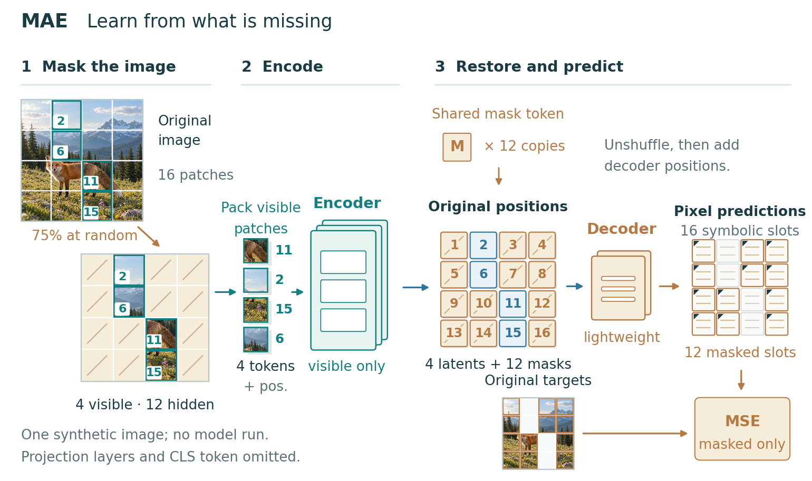

# MAE hybrid method figure

A guided rendering exploration using the same MAE pretraining facts as the earlier [vector example](../mae-v2/). A generated illustrative input gives the masking operation recognizable image content; exact patch crops, editable labels, model geometry, arrows and the loss branch preserve the scientific explanation.

This is a **hybrid figure**, not a fully vector figure. It contains an AI-generated raster scene as a teaching input. The scene is not a dataset sample, model reconstruction, experimental result, or evidence that MAE recovered the fox. The predicted pixels are symbolic slots; no model was run.



- `figure.svg`: editable text and vector geometry with embedded raster input/crops.
- `figure.pdf`: 7 × 4.15 inch export with embedded TrueType text; input content remains raster.
- `figure.png`: 220 dpi preview.
- `print-proof.png`: 110 dpi rendering of the PDF at its intended width.
- `grayscale-proof.png`: grayscale PDF rendering for checking redundant mask/position cues.
- `storyboards.png`: three structure candidates created before detailed rendering.
- `brief.md`, `caption.md`, `review.md`: representation contract, caption, provenance and review limits.
- `assets/fox-input.jpg`: committed 600 × 600 generated input asset. Its pixels are reused deterministically.
- `assets/generation-prompt.txt`: asset generation instructions. Re-running generation may produce different pixels.

## Reproduce

From the repository root, with Matplotlib, NumPy, Pillow and PyMuPDF installed:

```bash
python examples/mae-hybrid/build_storyboards.py
python examples/mae-hybrid/build_figure.py
```

An alternative square source image with a width divisible by four can be supplied with `--image PATH`. Changing the source image changes the teaching example and requires renewing the visual review. The default build uses the committed JPEG and needs no image-generation access.

The comparison is a qualitative design experiment on one paper, not a blinded study or measured improvement in comprehension. This figure shows how image-generation-style concrete examples and local depth can be combined with precise scientific marks; it does not establish that richer imagery is always better.
