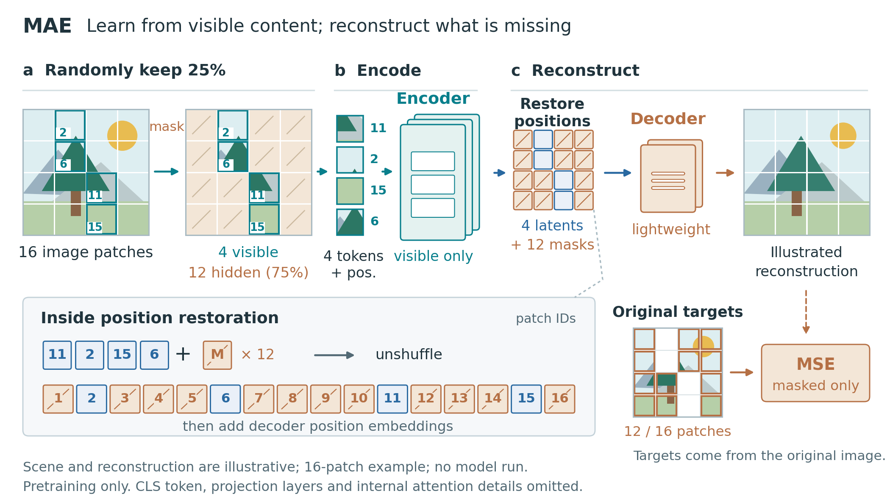

# MAE: example-driven method figure



An original 7 × 3.95-inch pretraining diagram with a recognizable procedural scene, persistent patch identities, visible-token packing, asymmetric model stacks, a position-restoration inset, and masked-only reconstruction supervision.

The scene and reconstructed content are illustrative, generated by vector geometry. No model was run and no reconstruction quality or experimental gain is claimed. The 16-patch construction makes a 75% mask ratio countable. See [caption.md](caption.md), [brief.md](brief.md), and [review.md](review.md) for interpretation and limitations.

## Rebuild

```bash
python examples/mae-v2/build_figure.py
```

The script resolves its default output directory relative to its own location, so it can also be run by absolute path. `--output-dir PATH` redirects all outputs. Matplotlib and Pillow are required; PyMuPDF enables the optional page proofs. The source is standalone and does not require the repository's JSON renderer.

Outputs are editable-text [SVG](figure.svg), vector [PDF](figure.pdf), 300-dpi [PNG](figure.png), grayscale and physical-width page proofs, and three rough [composition alternatives](storyboards.png). The three-layout comparison was added after the initial detailed draft when the revised skill became available; it is documented as a late design check.

Compare with the earlier [MAE method](../mae-method/figure.png). This is a same-paper revision with a narrower pretraining scope. It is not a matched with-skill versus without-skill benchmark.
