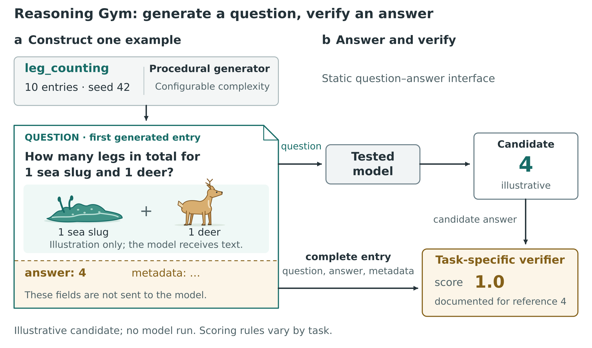

# Independent use of the art-direction guidance

An independent agent created this ReasoningGym setup figure using the revised skill and the supplied provenance ledger. It did not inspect the earlier figure, code, brief or review. The original animal illustrations, entry-sheet composition and exact routes are editable vectors.



The final figure is 7 × 4.125 inches. [SVG](reasoning-gym-setup.svg) retains live text and vector paths; [PNG](reasoning-gym-setup.png) is a 300-dpi preview. The [caption](caption.md) and [source ledger](sources.json) explain the documented example and its illustrative candidate. No model was run.

This is a forward test followed by review, not a claim that the unassisted first output was flawless. Three small external-feedback repairs removed an unsupported benchmark-status claim, added an explicit no-run disclosure, and clarified dataset length as “10 entries.” [The initial PNG](before-scope-fix.png) and [process notes](process-notes.md) preserve that history. No matched baseline or reader study was performed.

Rebuild with Python, Inkscape and Pillow installed:

```bash
python examples/reasoning-gym-forward/build_figure.py
```

The script resolves exports beside itself and has no image-generation dependency. The paper-width and grayscale proofs are inspection aids; no final manuscript template was supplied.
