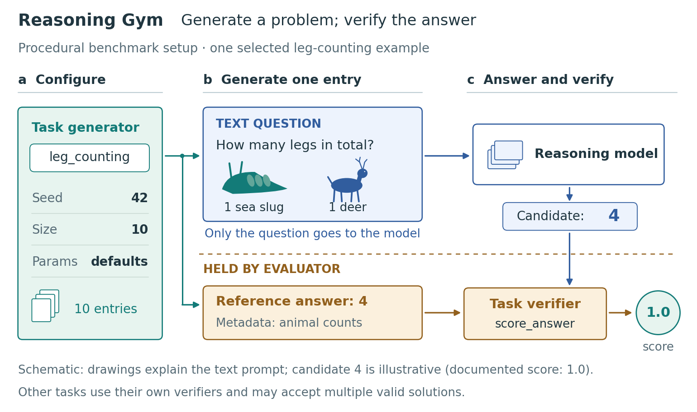

# Reasoning Gym: procedural benchmark setup

An original, source-grounded illustration of a single-turn task-generation and evaluation path. The three figure modes do not imply that every benchmark needs an interactive agent loop: this example shows construction of a question/reference pair, a model answer, and task-specific verification.



This is a guided worked example of the figure skill, not a reproduction of an author figure or a blind benchmark of agent performance. Animal drawings are original explanatory pictograms; Reasoning Gym supplies the selected question as text. The candidate response is illustrative. No model was run, and no benchmark performance is claimed.

Run from the repository root:

```bash
python examples/reasoning-gym-setup/build_figure.py
```

Dependencies: Python, Matplotlib, Pillow, and PyMuPDF (`fitz`). `--storyboards-only` creates the three composition alternatives without the full figure. `--output-dir PATH` writes the generated artifacts elsewhere.

The editable SVG, PDF with embedded fonts, and 220 dpi PNG are 7 × 4.15 inches. `print-proof.png` is rendered from the PDF at 110 dpi; `grayscale-proof.png` checks whether the information split remains understandable without color. Minimum figure text is 8.5 pt. See [brief.md](brief.md), [sources.json](sources.json), [caption.md](caption.md), and [review.md](review.md) for scope, provenance, interpretation, and limitations.

The paper was discovered on the June 2025 Hugging Face monthly list; this example uses the October 2025 paper revision and a pinned later implementation README. Those source versions are deliberately distinguished in the ledger.
