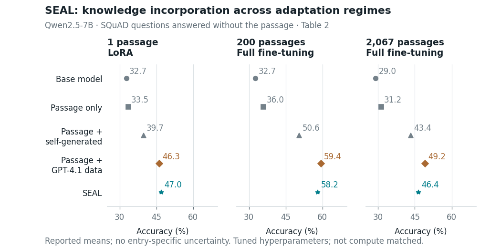

# SEAL: a composed teaser and a standalone graph


This example combines a generated, text-free notebook with editable vector text, arrows, a symbolic parameter update, and three exact-data plots. The graph area occupies about 64% of the usable width. The small Lyra passage is a constructed teaching example, not a recorded SEAL generation.



The plots include **all 15 values** in [SEAL v2, Table 2](https://arxiv.org/html/2506.10943v2): five methods across single-passage LoRA and two continued-pretraining conditions. SEAL's two lower results relative to GPT-4.1 data remain visible. No entry-specific uncertainty is reported, so no uncertainty is drawn. The experiments use tuned hyperparameters and are not presented as compute matched.

## Rebuild

From the repository root, after installing the repository's Python requirements and Inkscape/Poppler:

```bash
python examples/seal-composed/build.py
```

For independent assembly using the saved canonical geometry:

```bash
python skills/paper-figure-creation/scripts/compose_svg.py \
  examples/seal-composed/composition.json \
  --output examples/seal-composed/seal-teaser --formats svg,pdf,png --dpi 300
```

Edit `composition.json` for final panel placement, text, and connectors. Edit `results-panel.spec.json` or `seal-graphs.spec.json` for plot appearance. `build.py` reads these existing specifications; its bootstrap functions are used only when specifications are missing. The graph values and result IDs share the existing evidence ledger. PDF, SVG, and PNG are all exported from those sources, not independently redrawn.

## Files and review

| File | Purpose |
|---|---|
| `plan.md`, `layout-sketches.svg` | Three topology alternatives and the selection rationale |
| `composition.json` | Canonical final teaser assembly in physical points |
| `results-panel.spec.json` | Exact-data vector plot panel, 318 × 220 pt |
| `seal-graphs.spec.json` | Standalone graph specification, 504 × 250 pt |
| `assets/passage-notebook.jpg`, `assets/provenance.json` | Generated illustration, complete prompt, original checksum, encoding note |
| `seal-teaser.svg`, `.pdf`, `.png` | Editable and publication exports, 504 × 342 pt |
| `seal-graphs.svg`, `.pdf`, `.png` | Standalone graph exports |
| `*-print.png` | PDF rasterized at 72 pixels per inch; fixed-size proof |
| `*-pdf-proof.png`, `*-grayscale.png` | PDF appearance and grayscale checks |
| `*-review.json`, `seal-teaser.composition-report.json` | Numerical and physical checks; these are not substitutes for visual review |
| `review.md` | Actual inspected defects, corrections, and limitations |

Minimum text size is **8 pt** in both the source charts and final composed teaser. The embedded illustration is 586 ppi at the selected size. Its model identity was not exposed by the generation tool. Numerical marks and their labels remain vectors; the notebook is the only raster component.

The teaser summarizes evaluation-time adaptation after the rewrite policy has been learned with RL. It does not replace the [full SEAL method diagram](../seal/seal-method.svg), which explains the nested training loops. Native `.drawio` was not created or verified for this example: the native editable sources here are the JSON specifications plus SVG. No manuscript was supplied for compilation or page-neighbor inspection.
