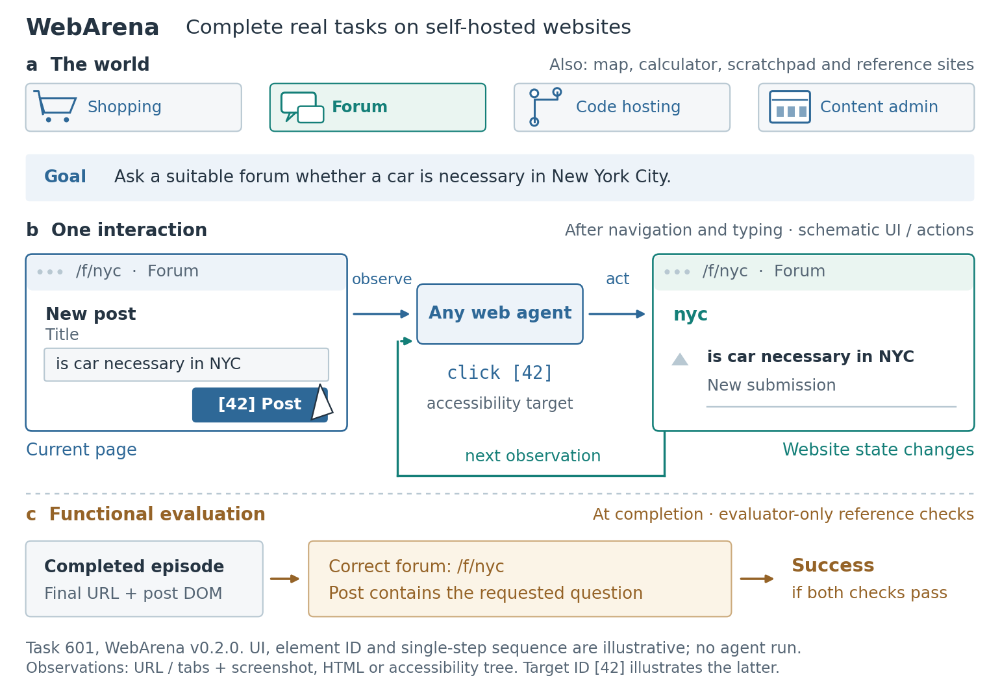

# WebArena benchmark / environment setup



This is a guided example of the skill's third mode. It explains what world an agent acts in, a concrete change caused by an action, and how the benchmark determines success. It is neither a proposed agent architecture nor an experimental result.

The task is sourced from the WebArena v0.2.0 release. The two interface states and the intervening action are original teaching illustrations, not screenshots or a recorded rollout. No model was run and no performance is claimed.

```bash
python examples/webarena-setup/build_figure.py
```

The script requires Matplotlib and is independent of the repository's template renderer. Run it from any working directory; outputs default to this folder. `--output-dir PATH` writes elsewhere and `--thumbnails-only` produces only the composition alternatives. The original figure uses editable SVG text and embedded TrueType PDF fonts. PNG: 220 dpi; print proof: 110 dpi at a 7-inch target width. No external image assets, fonts, downloads, or accounts are needed to rebuild it.

Files: [source and representation contract](brief.md), [source ledger](source-ledger.json), [caption and alt text](caption.md), [review](review.md), [composition alternatives](composition-thumbnails.png), [PDF](figure.pdf), [SVG](figure.svg).

`setup-contract.json` records eligibility, access boundaries, episode semantics and provenance for the evidence validator. It is a validation contract for the custom drawing; its geometry remains in `build_figure.py`, not in the template renderer's node format. Validate it from the repository root with:

```bash
python skills/paper-figure-creation/scripts/validate_evidence.py examples/webarena-setup/setup-contract.json
```

The scientific sources are the [WebArena paper](https://arxiv.org/html/2307.13854v4) and [pinned v0.2.0 task definitions](https://github.com/web-arena-x/webarena/blob/v0.2.0/config_files/test.raw.json). The author's [overview image](https://github.com/web-arena-x/webarena/blob/main/media/overview.png) was inspected as a reference and is not redistributed here.
