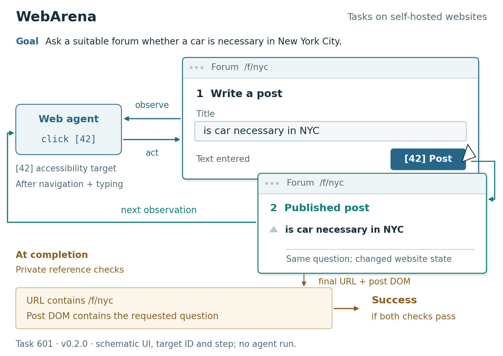

# WebArena: a foreground state change

An original vector setup figure for pinned WebArena task 601. The composition gives the website interaction the most space: a forum composer becomes a published post, the changed page returns to the agent, and the completed website state enters private functional checks.



- `figure.svg`: editable vector labels and shapes.
- `figure.pdf`: seven-inch-wide PDF with embedded TrueType fonts.
- `print-proof.png`: the exported PDF rasterized at 110 dpi.
- `grayscale-proof.png`: grayscale print proof.
- `composition-thumbnails.*`: three structural alternatives drawn before the full figure.
- `brief.md`, `caption.md`, `source-ledger.json`, `setup-contract.json`: scientific and visual contracts.

Rebuild from any working directory with an absolute path to `build_figure.py`, or run this from the repository root:

```bash
python examples/webarena-v3/build_figure.py
```

Dependencies: Matplotlib, Pillow, and PyMuPDF. `--output-dir PATH` changes the export directory; `--thumbnails-only` produces only the three composition studies.

The UI, ID 42 and one-step sequence are teaching illustrations. No agent was run, no success rate is claimed, and these exports have not been placed in a particular manuscript template. See `review.md` for the checks and remaining limits.
